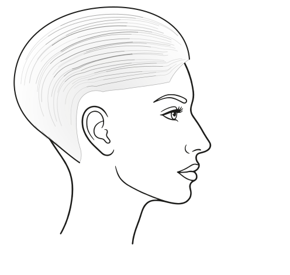

# Neue Profil-Vorlage (Entwurf 2)

Nur Kopf und Gesicht sind neu. Die App (`formwirkung-nase-profil.html`) ist **noch nicht** verändert.

Entwurf 1 (selbst gezeichnete Köpfe, Strähnen liefen an Stirn und Nacken zusammen) wurde verworfen:
nicht elegant genug, Frisur wirkte wie ein Helm.

## Entwurf 2

- **Kopf und Gesicht:** nach dem von Mirjam gelieferten Vorlagebild als Vektorpfad nachgezeichnet
  (potrace), gespiegelt auf die Blickrichtung der App (Nase nach rechts). Linien als gefüllte Pfade
  (`fill-rule="evenodd"`), dadurch die gleichmäßige, elegante Strichführung des Vorbilds.
- **Frisuren:** neu gezeichnet für diesen Kopf. Weiße Haarfläche deckt die Schädellinie ab, darüber
  eine zarte Grauverlauf-Schattierung, feine Strähnen und eine weiche Kontur.
- **Strähnen:** laufen zwischen Haaransatz und Kontur mit, beginnen und enden aber versetzt und werden
  an beiden Enden heller. Im Nacken laufen ein paar feine Spitzen leicht über die Kontur.
- Nur schwarz-weiß (Grautöne). Die Akzentfarbe nur für die Markierung „Nase unverändert“.

## Dateien

| Datei | Inhalt |
|---|---|
| `index.html` | Vorschau mit Umschaltern (Strähnen/Umriss, Markierung) |
| `profil-frau-vorlage.svg` | Kopf ohne Haar |
| `profil-frau-haar-A.svg` | Ausgangsform A (flach anliegend) |
| `profil-frau-haar-B.svg` | Zielwirkung B (Volumen am Hinterkopf, Richtung Diagonale Nase–Ohr) |

## Aufbau (Ebenen)

`viewBox="0 20 496 470"` wie in der App.

1. `<g id="kopf">` Kopf, Gesicht, Ohr, Hals – fix
2. `<g id="haar">` Haarfläche, Schattierung, Strähnen, Kontur – je Frisur austauschbar
3. `<g id="markierung">` fixes Merkmal in Akzentfarbe

Bezugspunkte der neuen Vorlage: Nasenspitze ≈ 360,265 · Ohrspitze ≈ 165,201 ·
Haaransatz Stirn 324,121 · Nacken 136,298.

## Was beim Einbau in die App passiert (nach Freigabe)

Weil der Kopf neue Proportionen hat, ändern sich auch die Bezugspunkte. Beim Einbau werden deshalb:

1. `kopf()` durch den neuen Kopfpfad ersetzt,
2. `NASENSPITZE`, `OHRSPITZE`, `ANSATZ`, `KOPFHAUT` auf die neuen Punkte gesetzt,
3. alle Profil-Frisuren (`FORM.A`, `FORM.B`, `FORM.M`, Oberkopf, Fehlerbilder, Pony, Baukasten-Profil)
   für den neuen Kopf nachgezogen,
4. die Strähnen-Funktion für jede Haarform ergänzt,
5. Farben über `var(--ink)` und `var(--accent)` geführt, damit Hell- und Dunkelmodus funktionieren.

Statisch lässt sich eine Datei direkt einbinden:

```html

```
