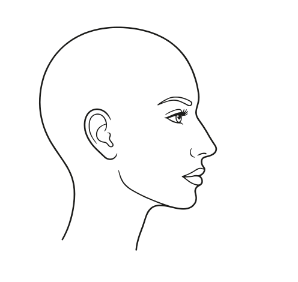

# Neue Profil-Vorlage (Entwurf)

Nur Kopf und Gesicht sind neu. Die App (`formwirkung-nase-profil.html`) ist **noch nicht** verändert.

## Dateien

| Datei | Inhalt |
|---|---|
| `index.html` | Vorschau mit Umschaltern (Frisur, Haardarstellung, Umriss, Markierung) und Vergleich zu bisher |
| `profil-frau-vorlage.svg`, `profil-mann-vorlage.svg` | Kopf ohne Haar |
| `profil-frau-haar-A.svg`, `profil-mann-haar-A.svg` | Ausgangsform A (flach anliegend) mit zarten Strähnen |
| `profil-frau-haar-B.svg`, `profil-mann-haar-B.svg` | Zielwirkung B (Volumen am Hinterkopf) mit zarten Strähnen |

## Aufbau (Ebenen)

Alle SVGs nutzen die `viewBox="0 20 496 470"` der App und dieselben Bezugspunkte:
Stirnansatz 296,132 · Nasenspitze 348,294 · Ohrspitze 203,216 · Nacken 150,372.
Deshalb passen alle vorhandenen Frisurenformen (`FORM.A`, `FORM.B`, Fehlerbilder …) ohne Änderung.

1. `<g id="haar">` Haarfläche, zarte Strähnen, Umriss – die einzige Ebene, die je Frisur getauscht wird
2. `<g id="schaedel">` Kopfform (nur ohne Frisur)
3. `<g id="kopf">` Haaransatz, Gesichtslinie, Nacken, Kieferlinie, Ohr
4. `<g id="gesicht">` Augenbraue, Auge, Nasenflügel, Mund
5. `<g id="markierung">` fixes Merkmal in Akzentfarbe (z. B. „Nase unverändert“)

## Zarte Strähnen

Die Strähnen werden aus zwei Linien berechnet, die an Stirn und Nacken dieselben Endpunkte haben:
Haaransatz (`ANSATZ`) und Außenkontur der Frisur. Dazwischen laufen ~34 Linien mit,
in kurze Züge unterbrochen, nach außen dünner und heller. Nur Grautöne auf Weiß.
Weil sie aus der Kontur berechnet werden, bekommt jede Frisur automatisch passende Strähnen,
auch beim Überblenden zwischen A, Zwischenstufe und B.

## So wird es in der App ausgetauscht (nach Freigabe)

Die App baut ihre SVGs per JavaScript. Getauscht werden nur Konstanten und die Funktion `kopf()`:

1. `NASE`, `GESICHT`, `NACKEN`, `OHR`, `AUGE` durch die neuen Pfade ersetzen
   (Frau: `KOPF.frau`, Mann: `KOPF.mann` aus `index.html`).
2. In `fig()` vor dem Haar-Umriss die Strähnen-Ebene einfügen:
   `s += '<g fill="none" stroke="var(--ink)" stroke-linecap="round">' + straehnen(H.o) + '</g>';`
3. Farben laufen weiter über `var(--ink)` und `var(--accent)`, damit Hell- und Dunkelmodus funktionieren.
4. `ANSATZ`, `KOPFHAUT`, `FORM`, `DIAG`, `NASENSPITZE`, `OHRSPITZE` bleiben unverändert.

Statisch (ohne JavaScript) lässt sich eine Datei direkt einbinden:

```html

```

oder als Ebenen übereinander (Frisur über fixem Kopf):

```html
<div style="position:relative">
  
  
</div>
```
